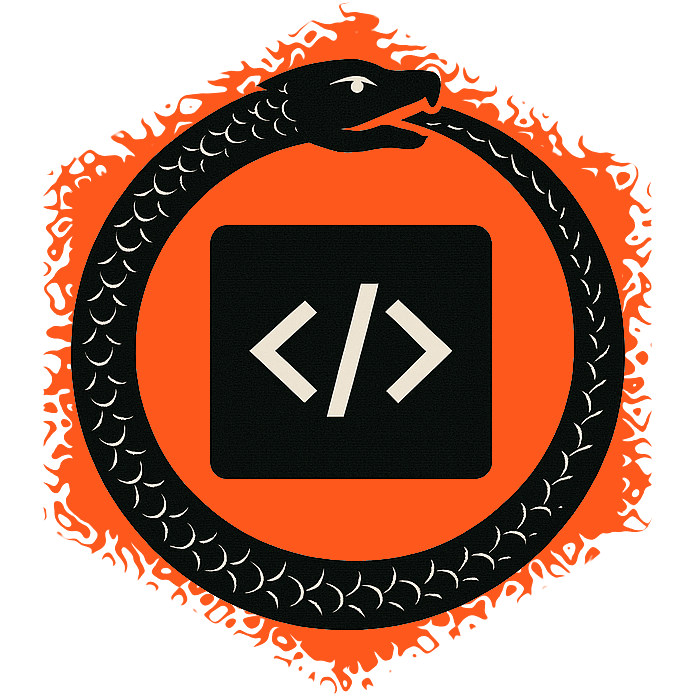

<div align="center">



# BOBBI

## Black OuroBorotic Box of Intelligence

*Chaos of creation ordered by logic.*

**A fully autonomous code development system where isolated AI agents collaborate through structured communication to solve programming problems.**

---

[Getting Started](#getting-started) | [How It Works](#how-it-works) | [Commands](#commands) | [Architecture](#architecture)

</div>

## Overview

BOBBI orchestrates multiple AI agents -- each with a distinct role and isolated workspace -- to develop, evaluate, and refine code autonomously. Agents communicate indirectly through a queue-based system and never see each other's internals, preventing overfitting and ensuring genuine, independent work.

The result is a closed-loop development cycle where a **Solver** writes code, an **Evaluator** tests it, an **Architect** maintains the specification, and a **Reviewer** checks quality -- all without human intervention.

## Getting Started

### Prerequisites

- **Go 1.25+**
- **Git**
- **Claude CLI** (`claude`) installed and available on PATH

### Build

```bash
go build -o bobbi .
```

### Usage

```bash
# Initialize a new BOBBI workspace
bobbi init

# Start the orchestration loop
bobbi up

# Run the MCP server for a specific agent (used internally)
bobbi mcp --agent <solver|evaluator|reviewer>
```

## How It Works

BOBBI follows an ouroboric development loop:

```
  ┌────────┐   problem
  │  User  │   specification          ┌─────────────┐
  │        │─────────────────────────►│  Architect  │
  │        │              spec        │             │    spec
  │        │          ┌──────────────►│   <specs>   │◄──────────┐
  │        │          │               └─────────────┘           │
  │        │          │                                         │
  │        │     architecture                              architecture
  │        │     changes                                   changes
  │        │          │                                         │
  │        │          ▼                                         ▼
  │        │    ┌───────────┐       deliverable        ┌─────────────┐
  │        │    │           │─────────────────────────►│  Evaluator  │
  │        │    │  Solver   │◄─────────────────────────│   <tests>   │
  │        │    │  <code>   │◄───┐ change requests     └──┬──────┬───┘
  │        │    └───────────┘    │                        │      │
  │        │       code │        │ change requests        │      │
  │        │            ▼        │                        │      │
  │        │         ┌────────────┐           test results│      │
  │        │         │  Reviewer  │◄──────────────────────┘      │
  │        │         │ <analysis> │                              │
  │        │         └────────────┘                              │
  │        │◄──────────────────────── confirmed solution ────────┘
  └────────┘
```

1. The **User** provides a problem specification, which is handed to the **Architect**
2. The **Architect** produces a technical contract from the specification
3. The **Solver** reads the contract and writes a solution
4. The **Evaluator** independently writes tests from the contract and runs them against the solution
5. The **Reviewer** inspects code quality and provides feedback
6. Agents request changes from each other via MCP tools, forming a feedback loop
7. Once the **Evaluator** confirms the solution, the deliverable is returned to the **User**

## Commands

| Command | Description |
|---------|-------------|
| `bobbi init` | Scaffolds the workspace: creates `.bobbi/`, agent repositories (`solution/`, `evaluation/`, `architecture/`, `review/`), and seeds each with initial context |
| `bobbi up` | Starts the main orchestrator loop -- watches queues, schedules agents, and manages the development cycle |
| `bobbi mcp --agent <name>` | Launches an MCP server (stdio transport) exposing agent-specific tools for inter-agent communication |

## Architecture

### Agent Isolation

Each agent operates in its own git repository with strictly controlled visibility:

| Agent | Can See | Cannot See |
|-------|---------|------------|
| **Solver** | Architecture contract | Evaluator tests |
| **Evaluator** | Architecture contract, solution deliverable | Solver source code |
| **Architect** | Problem specification | Any other repository |
| **Reviewer** | Solution code, test results | |

Agents are unaware of BOBBI's existence -- they receive only the context relevant to their role.

### Queue-Based Communication

Agents don't communicate directly. Instead, MCP tool calls produce request files in `.bobbi/queues/`:

```yaml
timestamp: 2024-06-01T12:00:00Z
request:
  type: request_solution_change
  from: evaluator
  additional_context: "..."
```

The orchestrator watches this directory, dequeues requests in order, and ensures only one instance of each agent type runs at a time.

### Workspace Layout

```
project/
├── .bobbi/
│   ├── queues/         # Pending request files
│   └── completed/      # Processed request archive
├── architecture/       # Architect's repository
│   ├── .claude/
│   └── SPECIFICATION.md
├── solution/           # Solver's repository
│   ├── .claude/
│   ├── architecture/       # (read-only mount)
│   └── solution-deliverable/
├── evaluation/         # Evaluator's repository
│   ├── .claude/
│   ├── architecture/       # (read-only mount)
│   └── solution-deliverable/
└── review/             # Reviewer's repository
    ├── .claude/
    ├── architecture/       # (read-only mount)
    └── solution/           # (read-only mount)
```

### MCP Tools by Agent

**Solver** -- `handoff_solution`, `request_architecture_change`

**Evaluator** -- `request_architecture_change`, `request_solution_change`, `confirm_solution`

**Reviewer** -- `request_solution_change`

## Dogfooding

BOBBI is developed using BOBBI. The very system described above -- architect, solver, evaluator, reviewer -- is the same system that builds and refines its own codebase.

This ouroboric setup is not just a novelty. It serves as a continuous integration test of the system itself: if BOBBI can successfully orchestrate its own development, it validates the core design. Bugs in the orchestrator, gaps in the contract, or flaws in agent communication surface naturally as the system tries to improve itself.

## License

TBD
